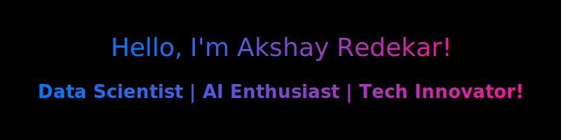

## 🌟 About Me  

Hi there! 👋 I’m **Akshay Redekar**, a **Machine Learning Engineer and AI Researcher** passionate about building intelligent solutions for real-world automation.  
### 💡 Core Expertise:  
- **Machine Learning**: Crafting predictive algorithms and utilizing deep learning for innovative automation.  
- **Data Science**: Interpreting complex datasets to derive meaningful insights.  
- **Artificial Intelligence**: Designing smart systems to address practical challenges.  
- **Cloud Infrastructure**: Building scalable applications while optimizing resource utilization.  

### 🎯 Current Focus:  
I am currently building a **large language model (LLM)** from scratch to deeply understand the nuts and bolts of LLMs and push the boundaries of advanced AI capabilities.

### 🌱 Forever Learning:  
Continuously exploring **advanced deep learning architectures, cloud computing (GCP), and AI-driven automation** to push the boundaries of what's possible.  

### 💬 Let’s Connect:  
Feel free to reach out! 🚀  

  
  
  
  
  <!--  -->
  <!--  -->

### 🤖 Tech Stack 

  <!-- Core Generative AI & Frameworks -->
  
  
  
  
  
  

  <!-- Agentic & Retrieval Tools -->
  
  
  
  

  <!-- NLP & Libraries -->
  
  

  <!-- ML/DL Frameworks -->
  
  
  
  
  
  
  

  <!-- App & API Dev -->
  

  <!-- Data & Databases -->
  
  
  
  

  <!-- DevOps & Cloud -->
  
  

  <!-- Programming & Tools -->
  
  
  
  

###  **GitHub Stats**

<!--

  
  

-->

